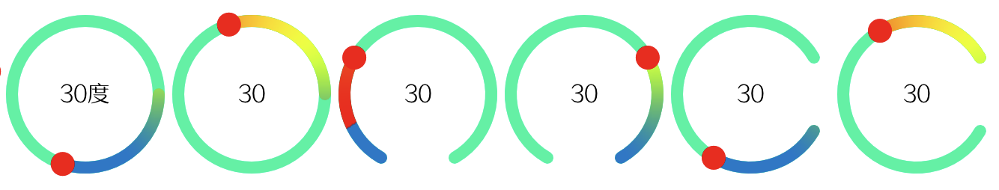

# awtk-widget-slider_circle

slider_circle 控件。

主要特色：

* 支持正向和反向
* 支持设置滑块的半径
* 支持背景线宽和颜色
* 支持前景线宽和颜色
* 支持设置是否显示值的文本
* 支持设置起始角度和结束角度
* 支持设置格式化值的格式字符串
* 支持使用图片填充背景和前景

界面效果：



注意：

 * 水平向右为 0 度，顺时针为正，逆时针为负
 * end\_angle 必须大于 start\_angle
 * end\_angle - start\_angle 必须小于等于 360
 * 正向：从 start\_angle 到 end\_angle 滑动时，值不断增加，反之值减少
 * 反向：从 end\_angle 到 start\_angle 滑动时，值不断增加，反之值减少

## 准备

1. 获取 awtk 并编译

```
git clone https://github.com/zlgopen/awtk.git
cd awtk; scons; cd -
```

## 运行

1. 生成示例代码的资源

```
python scripts/update_res.py all
```
> 也可以使用 Designer 打开项目，之后点击 “打包” 按钮进行生成；
> 如果资源发生修改，则需要重新生成资源。

如果 PIL 没有安装，执行上述脚本可能会出现如下错误：
```cmd
Traceback (most recent call last):
...
ModuleNotFoundError: No module named 'PIL'
```
请用 pip 安装：
```cmd
pip install Pillow
```

2. 编译

* 编译 PC 版本

```
scons
```

* 编译 LINUX FB 版本

```
scons LINUX_FB=true
```

> 完整编译选项请参考 [编译选项](https://github.com/zlgopen/awtk-widget-generator/blob/master/docs/build_options.md)

3. 运行

```
./bin/demo
```

## 文档

[完善自定义控件](https://github.com/zlgopen/awtk-widget-generator/blob/master/docs/improve_generated_widget.md)
